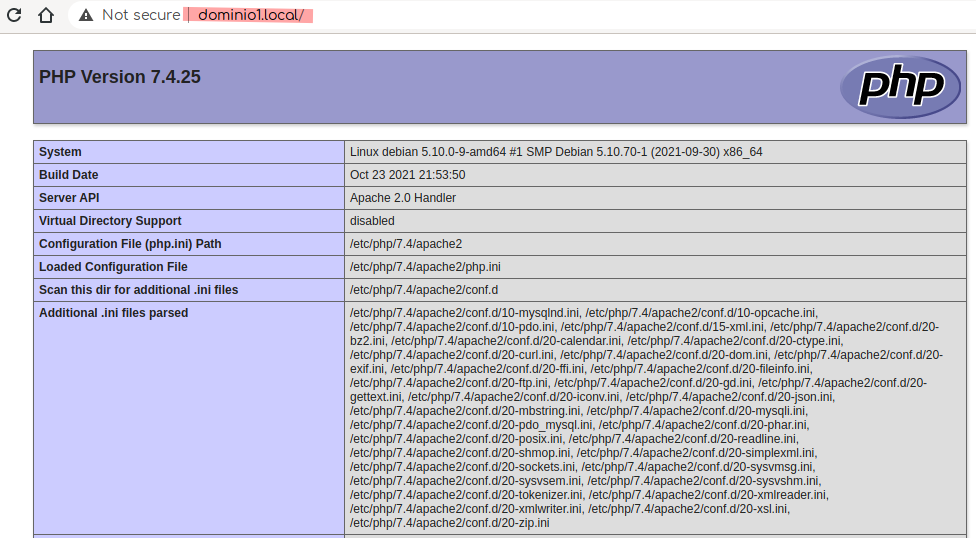
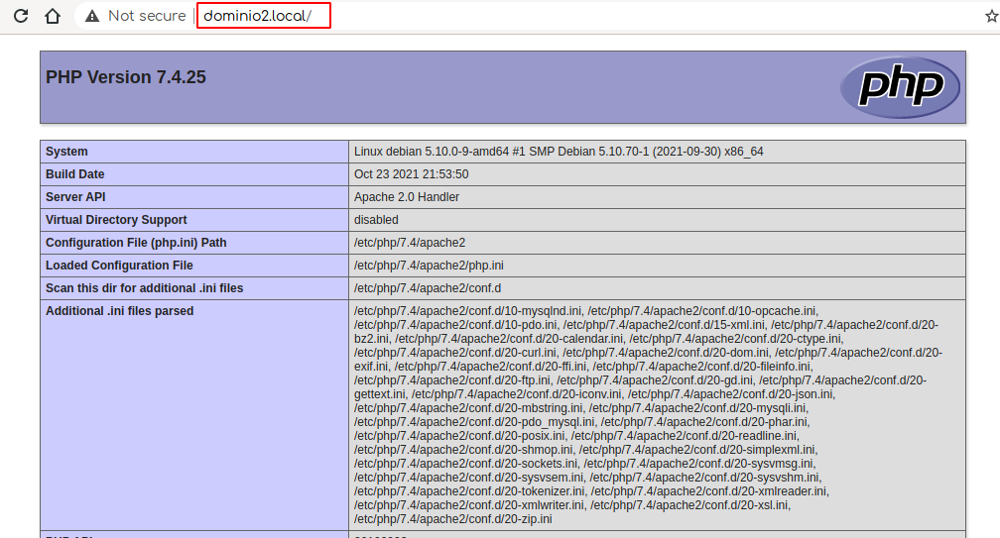
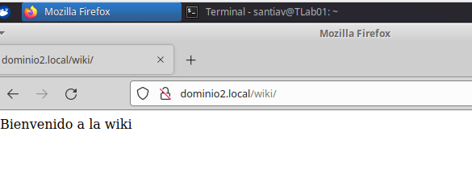
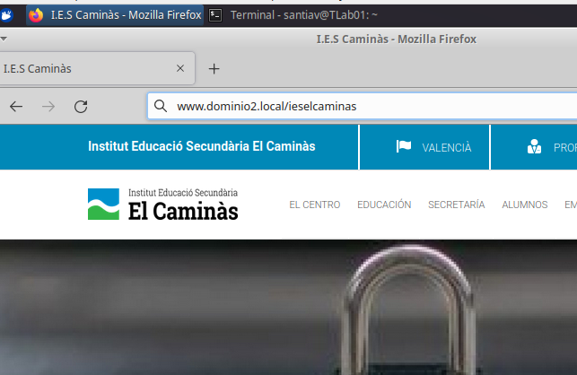
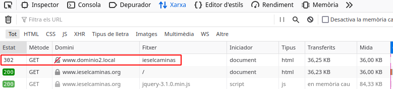
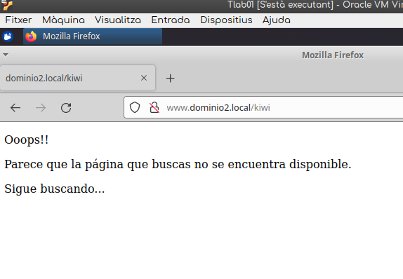

# Apache instalación

El primer paso para configurar nuestro servidor de páginas web en linux es la instalación de LAMP (Linux + Apache + MySQL + PHP):

```bash
$ sudo apt install apache2 mysql-common php -y
```

---

# Apache configuración

### Tarea 1

La configuración de Apache está basada en la configuración de los denominados Virtualhosts, y se basa en tres componentes:

1. El archivo _*/etc/hosts*_, donde le indicaremos al sistema en que ip debe buscar algún dominio personalizado por nosotros.  Normalmente redirigimos a localhost:

   ```bash
   127.0.0.1       localhost
   127.0.1.1       debian

   ## anyadidos para asignatura PEPS por santi
   127.0.0.1       dominio1.local
   127.0.0.1       www.dominio1.local
   127.0.0.1       dominio2.local
   127.0.0.1       www.dominio2.local

   # The following lines are desirable for IPv6 capable hosts
   ::1     localhost ip6-localhost ip6-loopback
   ff02::1 ip6-allnodes
   ff02::2 ip6-allrouters


   ```

   2. El segundo componente se basa en los archivos de configuración de los Virtualhosts,  que se encuentran dentro de /etc/apache2/sites-available.   Dentro de este directorio crearemos los archivos *.conf que contendrán las indicaciones de acceso nuestro *DocumentRoot* y a los demás archivos, que será enlazado posteriormente por el dominio correspondiente.

   ```bash
     $ cat /etc/apache2/sites-available/000-default.conf
   ```

   ```bash
     <VirtualHost dominio1.local:80> # The ServerName directive sets the request scheme, hostname and port that
      # the server uses to identify itself. This is used when creating
      # redirection URLs. In the context of virtual hosts, the ServerName
      # specifies what hostname must appear in the request's Host: header to
      # match this virtual host. For the default virtual host (this file) this
      # value is not decisive as it is used as a last resort host regardless.
      # However, you must set it for any further virtual host explicitly.
      #ServerName www.example.com
     ServerAdmin webmaster@localhost
      DocumentRoot /var/www/html/dominio1
     # Available loglevels: trace8, ..., trace1, debug, info, notice, warn,
      # error, crit, alert, emerg.
      # It is also possible to configure the loglevel for particular
      # modules, e.g.
      #LogLevel info ssl:warn
     ErrorLog ${APACHE_LOG_DIR}/error.log
      CustomLog ${APACHE_LOG_DIR}/access.log combined
     # For most configuration files from conf-available/, which are
      # enabled or disabled at a global level, it is possible to
      # include a line for only one particular virtual host. For example the
      # following line enables the CGI configuration for this host only
      # after it has been globally disabled with "a2disconf".
      #Include conf-available/serve-cgi-bin.conf</VirtualHost>
     <VirtualHost dominio1.local:80>
      # The ServerName directive sets the request scheme, hostname and port that
      # the server uses to identify itself. This is used when creating
      # redirection URLs. In the context of virtual hosts, the ServerName
      # specifies what hostname must appear in the request's Host: header to
      # match this virtual host. For the default virtual host (this file) this
      # value is not decisive as it is used as a last resort host regardless.
      # However, you must set it for any further virtual host explicitly.
      #ServerName www.example.com
     ServerAdmin webmaster@localhost
      DocumentRoot /var/www/html/dominio1
     # Available loglevels: trace8, ..., trace1, debug, info, notice, warn,
      # error, crit, alert, emerg.
      # It is also possible to configure the loglevel for particular
      # modules, e.g.
      #LogLevel info ssl:warn
     ErrorLog ${APACHE_LOG_DIR}/error.log
      CustomLog ${APACHE_LOG_DIR}/access.log combined
     # For most configuration files from conf-available/, which are
      # enabled or disabled at a global level, it is possible to
      # include a line for only one particular virtual host. For example the
      # following line enables the CGI configuration for this host only
      # after it has been globally disabled with "a2disconf".
      #Include conf-available/serve-cgi-bin.conf


   </VirtualHost>
   ```

Por ello, la configuración de nuestro host virtual dominio1.conf en apache podría ser algo así:

```bash
<VirtualHost dominio1.local:80>

	ServerName www.dominio1.local
	#ServerAdmin webmaster@localhost
	DocumentRoot /var/www/html/dominio1

	ErrorLog ${APACHE_LOG_DIR}/error.log
	CustomLog ${APACHE_LOG_DIR}/access.log combined

    <Directory "/var/www/html/dominio1">
		AllowOverride All
		Require all granted
		Allow from all
	</Directory>

</VirtualHost>
```

Y nuestro host virtual _dominio2_

```bash
<VirtualHost dominio2.local:80>

	ServerName www.dominio2.local
	#ServerAdmin webmaster@localhost
	DocumentRoot /var/www/html/dominio2

	ErrorLog ${APACHE_LOG_DIR}/error.log
	CustomLog ${APACHE_LOG_DIR}/access.log combined

    <Directory "/var/www/html/dominio2">
		AllowOverride All
		Require all granted
		Allow from all
	</Directory>

</VirtualHost>
```

3. El tercer componente de la configuración de Apache, consiste en la localización del archivo que aloja a todos los archivos que componen nuesta página.   Éste irá alojado en la dirección que figure en nuestro _DocumentRoot_, y que por defecto suele ser _/var/www/html_, pero en caso que figure en un sitio distinto especificaremos las directivas locales.  Esto es útil, principalmente, en el caso de hostings compartidos.

   Nosotros crearemos dos carpetas en nuestro repositorio local (/var/www/html/) y las nombraremos como  _dominio1_ y _dominio2_, y dentro de ellas crearemos un archivo _index.php_.  También crearíamos varias carpetas para alojar los distintos tipos de archivos que completará nuestra página web, como puede ser la carpeta _Images_.

```php
<?php
phpinfo();
?>

```

---




---



### Tarea 2.-  Directorios Virtuales

Ahora definiremos el uso de _Alias_, que son directorios que se encuentran fuera de nuestro directorio principal y a los que haremos referencia desde nuestro _DocumentRoot_.

Para su uso en esta tarea, crearemos el directorio /usr/share/wiki

```bash
$ sudo mkdir /usr/share/wiki
```

y dentro crearemos el archivo _index.php_ con el siguiente texto:

```php
    <?php
    echo "Bienvenido a mi wiki";
```

Seguídamente editaremos nuestro archivo _dominio2.conf_ que se encuentra en /etc/apache2/sites-avaliable/

```bash
<VirtualHost dominio2.local:80>
	ServerName www.dominio2.local
	ServerAlias dominio2.local
	DocumentRoot /var/www/html/dominio1

	Alias /wiki /usr/share/wiki
        <Directory /usr/share/wiki>
                DirectoryIndex index.php
                AllowOverride All
                Require all granted
                Allow from all
        </Directory>
        
</VirtualHost>
```

Ahora cuando introducimos la dirección http://www.dominio2.local/wiki, éste es el resultado:




### Tarea 3.-  Redirect


En esta tarea configuraremos una redirección que nos cargará el contenido de la páquina a la cual hagamos referencia.

Para ello, tan solo añadiremos una linea de código en el DocumentRoot, con la palabra reservada Redirect, seguida del componente de nuestra url y seguídamente de la url referenciada.

```bash
    Redirect /ieselcaminas https://wwww.ieselcaminas.org
```

Este será nuestro documento completo:

```bash
<VirtualHost dominio2.local:80>
	ServerName www.dominio2.local
	ServerAlias dominio2.local
	DocumentRoot /var/www/html/dominio1

	Alias /wiki /usr/share/wiki
        <Directory /usr/share/wiki>
                DirectoryIndex index.php
        </Directory>

	Redirect /ieselcaminas https://www.ieselcaminas.org	

</VirtualHost>

```

Cuando escribamos la dirección http://www.dominio2.local/ieselcaminas indicará que la página se ha movido, mediante un Status Code 3xx (302), que resolverá inmediatamente obteniendo un Status Code 200 y cargando la página referenciada.







### Tarea 4.-  Respuesta de error personalizada.

Para esta tarea seguiremos las indicaciones que podemos encontrar en https://httpd.apache.org/docs/2.2/es/custom-error.html  y que configuraremos con la sintaxis, dentro de nuestro _DocumentRoot_ :

ErrorDocument <código-3-dígitos> <acción>

```bash
ErrorDocument <código-3-dígitos> <acción>
```

Nuestra configuración será:
```bash
ErrorDocument 404 "<p><p>Ooops!! <p>Parece que la p&aacutegina que buscas no se encuentra disponible.<p>Sigue buscando..."
```

Y este es el resultado:





