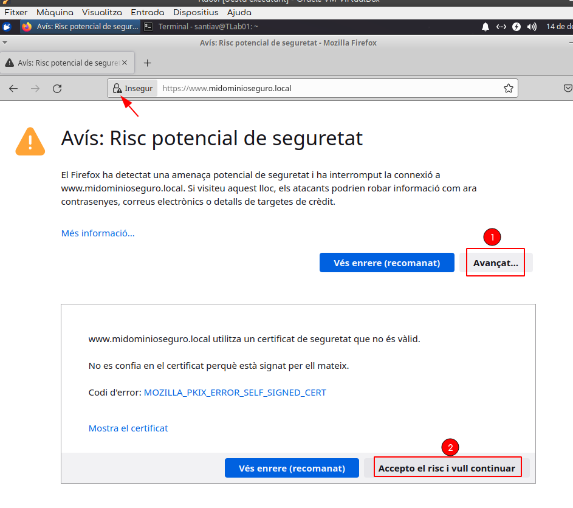
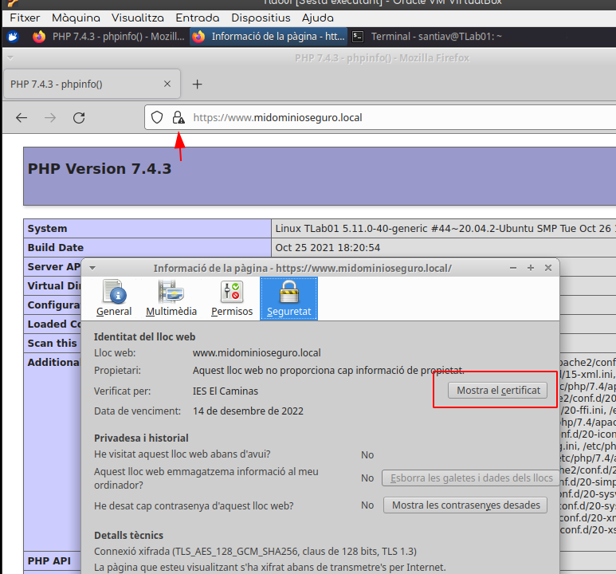
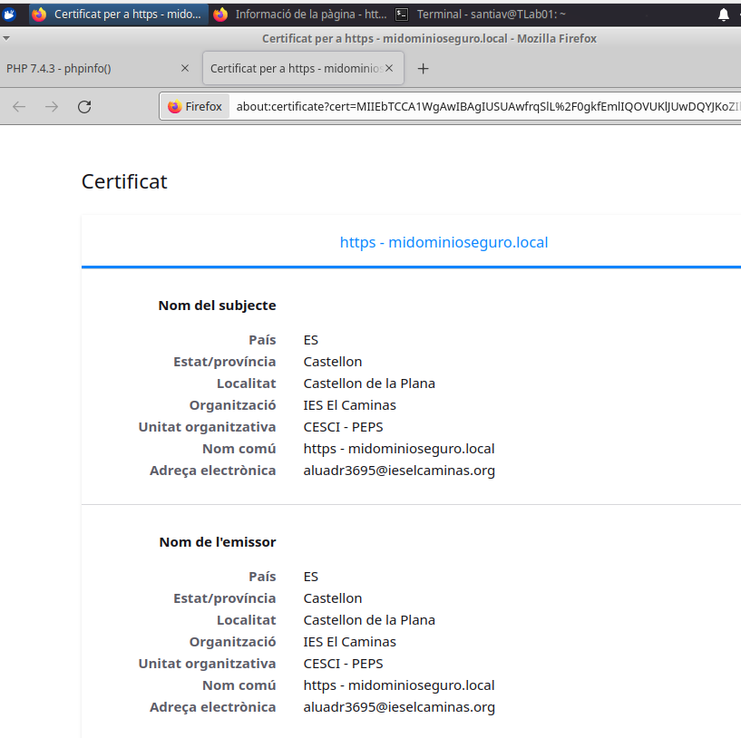

# Apache - Certificado digital.

Para asegurar nuestras conexiones deben ir cifradas y para ello debemos instalar un certificado autofirmado digital en nuestro servidor apache, para poder transmitir la información de forma segura.  De esto mismo tratará nuestra siguiente tarea:

### Tarea 5 Instalación de un certificado digital en Apache.


##### 1. Instalaremos el módulo SSL en Apache y reinicaremos el servicio.

```bash
$ sudo a2enmod ssl
$ sudo systemctl restart apache2
```

##### 2. Crearemos una carpeta _ssl_ en el directorio de apache2, donde almacenaremos el  Certificado SSL Auto-firmado.

```bash
$ sudo mkdir /etc/apache2/ssl
$ cd /etc/apache2/ssl
```

##### 3. Para crear la clave y el certificado en el directorio que acabamos de crear, ejecutaremos la siguiente orden:
```bash
$ sudo openssl req -x509 -nodes -days 365 -newkey rsa:2048 -keyout /etc/apache2/ssl/apache.key -out /etc/apache2/ssl/apache.crt

```
Seguídamente nos formulará una serie de preguntas que iremos respondiendo

```bash
santiav@TLab01:~$ sudo openssl req -x509 -nodes -days 365 -newkey rsa:2048 -keyout /etc/apache2/ssl/apache.key -out /etc/apache2/ssl/apache.crt
Generating a RSA private key
....................................................................+++++
......................+++++
writing new private key to '/etc/apache2/ssl/apache.key'
-----
You are about to be asked to enter information that will be incorporated
into your certificate request.
What you are about to enter is what is called a Distinguished Name or a DN.
There are quite a few fields but you can leave some blank
For some fields there will be a default value,
If you enter '.', the field will be left blank.
-----
Country Name (2 letter code) [AU]:ES
State or Province Name (full name) [Some-State]:Castellon
Locality Name (eg, city) []:Castellon de la Plana
Organization Name (eg, company) [Internet Widgits Pty Ltd]:IES El Caminas
Organizational Unit Name (eg, section) []:CESCI - PEPS
Common Name (e.g. server FQDN or YOUR name) []:https - midominioseguro.local
Email Address []:aluadr3695@ieselcaminas.org
```

##### 4.  Una vez creada la clave y el certificado, modificaremos el archivo de configuración (default-ssl.conf) para adaptarlo.  

Básicamente seguiremos las mismas normas que ya conocemos, y le indicaremos, mediante directivas,  la ruta de las claves (_SSLCertificateKeyFile_) y certificados(_SSLCertificateFile_)

```bash
$ sudo nano /etc/apache2/sites-avaliable/default-ssl.conf
```
 
 Nos quedará asi:
 
 ```bash
<IfModule mod_ssl.c>
	<VirtualHost _default_:443>
		ServerAdmin aluadr3695@ieselcaminas.org
		ServerName  www.midominioseguro.local

		DocumentRoot /var/www/html
		
		ErrorLog ${APACHE_LOG_DIR}/error.log
		CustomLog ${APACHE_LOG_DIR}/access.log combined
		
		SSLEngine on

		SSLCertificateFile	/etc/apache2/ssl/apache.crt
		SSLCertificateKeyFile /etc/apache2/ssl/apache.key
		
		<FilesMatch "\.(cgi|shtml|phtml|php)$">
				SSLOptions +StdEnvVars
		</FilesMatch>
		<Directory /usr/lib/cgi-bin>
				SSLOptions +StdEnvVars
		</Directory>

		BrowserMatch "MSIE [2-6]" \
				nokeepalive ssl-unclean-shutdown \
				downgrade-1.0 force-response-1.0

	</VirtualHost>
</IfModule>
```

   ##### 5. Configuraremos el archivo /etc/hosts
   
   ```bash
127.0.0.1	localhost
127.0.0.1	www.midominioseguro.local
```

##### 6.  Activación del Host Virtual con SSL, y reinicio de Apache.

```bash
 $ sudo a2ensite default-ssl.conf
 $ sudo systemctl restart apache2
```

Y comprobamos que todo ha ido correcto, insertando _www.midominioseguro.local_ en la caja de búsqueda de nuestro navegador.











