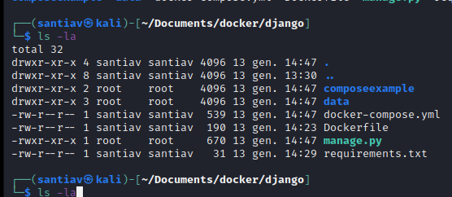
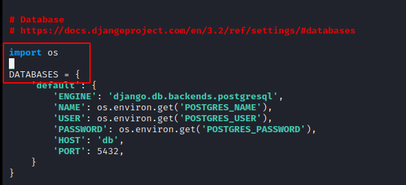
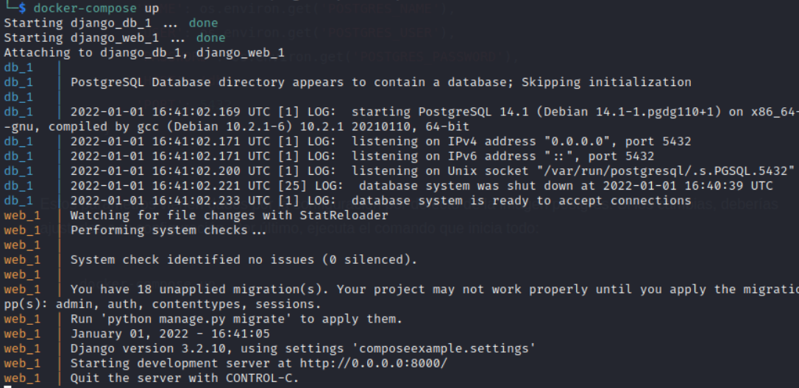
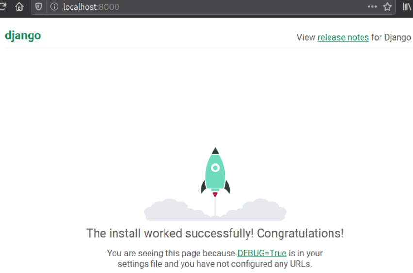

# Práctica Django


### Instalación Django

De un modo parecido a Wordpress, para instalar Django habrá que crear un archivo de requerimientos adicional, por lo que al crear el directorio django éste contendrá tres archivos: _Dockerfile_, _requierements.txt_ y _docker-compose.yml_.

```bash
$ mkdir django
$ cd django
```
Siguiendo las instrucciones que nos proporciona el siguiente [enlace](https://docs.docker.com/samples/django/), copiaremos lo siguiente en el archivo Dockerfile:

```bash
# syntax=docker/dockerfile:1
FROM python:3
ENV PYTHONDONTWRITEBYTECODE=1
ENV PYTHONUNBUFFERED=1
WORKDIR /code
COPY requirements.txt /code/
RUN pip install -r requirements.txt
COPY . /code/
```
Como puedes comprobar _Dockerfile_ comprobará si está instalado pyhon en su versión 3 y se encargará de instalarlo, si no lo está,  junto a las dependencias requeridas que vendrán referenciadas en el archivo _requirements.txt_, que tendrá este contenido: 

```bash
Django>=3.0,<4.0
psycopg2>=2.8
```

Y ya te queda completar el archivo docker-compose.yml, que se verá así:

```bash
version: "3.3"
       
services:
  db:
    image: postgres
    environment:
      - POSTGRES_NAME=postgres
      - POSTGRES_USER=postgres
      - POSTGRES_PASSWORD=postgres
    volumes:
      - ./data/db:/var/lib/postgresql/data
  web:
    build: .
    command: python manage.py runserver 0.0.0.0:8000
    volumes:
      - .:/code
    ports:
      - "8000:8000"
    environment:
      - POSTGRES_NAME=postgres
      - POSTGRES_USER=postgres
      - POSTGRES_PASSWORD=postgres
      - POSTGRES_HOST_AUTH_METHOD=trust
    depends_on:
      - db
```

Si ananlizas el código verás que define dos servicions, uno para la base de datos y otro para el servicio web. 

### Construir el proyecto

Ejecutaremos _docker-compose_ en modo root del siguiente modo:

```bash
$ sudo docker-compose run web django-admin startproject composeexample .
```

Si ahora listas el directorio observarás que algunas carpetas son propiedad de  root





Para evitar problemas ejecutaremos
```bash
$ sudo chown -R $USER:$USER .
```

### Conexión a la Base de Datos

1. Desplázate al directorio _composeexample_ y edita el fichero _settings.py_
2. Busca la fila que empieza por __DATABASES = ...__ y reemplaza o completa con lo siguiente:
```bash
DATABASES = {
    'default': {
        'ENGINE': 'django.db.backends.postgresql',
        'NAME': os.environ.get('POSTGRES_NAME'),
        'USER': os.environ.get('POSTGRES_USER'),
        'PASSWORD': os.environ.get('POSTGRES_PASSWORD'),
        'HOST': 'db',
        'PORT': 5432,
    }
}
```



Es hora de ejecutar docker-compose -d y comprobar el resultado en el puerto 8000 de tu ip local






 
