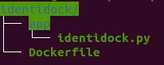

# Práctica Python Identidock


Para la ejecución de la siguiente práctica vamos a crear varias ramas del mismo  (_branches_) y versiones (_tags_) de un repositorio, que ejecuta un container que genera imágenes aleatorias pixeladas.

###  Rama principal - Hello World!!


En primer lugar tienes que crear un repositorio nuevo y clonarlo dentro de un directorio de tu máquina local, por ejemplo https://github.com/tu_usuario/identidock.

A continuación, crea la estructura de archivos necesaria para realizar el proyecto que es



Y editarás el archivo _identidock.py_ con el siguiente código:

```bash
from flask import Flask
app = Flask(__name__)

@app.route('/')
def hello_world():
    return 'Hello World!\n'

if __name__ == '__main__':
    app.run(debug=True, host='0.0.0.0')

```

Y ahora editarás el archivo _Dockerfile_ con este otro código:
```bash
FROM python:3.4
RUN pip install Flask==0.10.1
WORKDIR /app
COPY app /app
CMD ["python", "identidock.py"]
```

Esto usará flask (framework minimalista que crea aplicaciones web, escrito en python) para desarrollar una aplicación, creará una ruta asociada a una URL, que se ejecutará sobre el servidor web de pthon.

Para que vaya tomando sentido, vas a ejecutar lo siguiente:

```bash
    docker build -t identidock .
    docker run -d -p 5000:5000 identidock
```

Verás que construye la imagen de un container a la que le realizarás la siguiente petición:

```bash
$ cul localhost:5000
```


Ahora modificarás el código para que no haya que estar reiniciando el contendor cada vez que cambiemos el código, donde el argumento _-v $(pwd)/app:/app_ trasladará la carpeta app de nuestro host al directorio app del container montado.
  _*Nota: Fíjate  que los nombres de los directorios deben coincidir con los directorios que  hemos indicado en el archivo Dockerfile_

```bash
$     docker run -d -p 5000:5000 -v "$(pwd)"/app:/app identidock
```    
     
Si vuelves a realizar la petición _$ curl localhost:5000_ obtendrás el mismo resultado.

Ahora necesitarás parar y borrar el contenedor, por lo que detendrá el último (_-lq_) que hemos utilizado mediante las siguientes lineas.

```bash
$ docker stop $(docker ps -lq)
$ docker rm $(docker ps -lq)
```


   Ahora modificarás tu archivo _identidock_ para mostrar un contenido ligeramente diferente:
   
   ```bash
    from flask import Flask
    app = Flask(__name__)
    
    @app.route('/')
    def hello_world():
        return 'Hello World from Ciberseguridad!\n'
    
    if __name__ == '__main__':
        app.run(debug=True, host='0.0.0.0')
```
   
   
 Ahora si ejecutas de nuevo el contenedor y realizas la peticion curl al puerto 5000 de localhost, verás esto:


Ahora vas a guardar un tag de esta versión.  Para ello debes actualizar tu repositorio remoto y crearás un tag:
    1. Crea un commit con el mensaje de la version v1.
    2. Harás un push del commit creado.
    3. Crea un tag con el comando _git tag v1_
    4. Haz _git push origin v1_


### 2 Identicons

Después de guardar el primer tag, ahora vas a crear una nueva rama y cambiarás a la nueva rama creada:
- _git branch identicons_
- _git checkout identicons_


