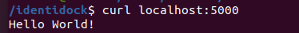

# Práctica Python Identidock


Para la ejecución de la siguiente práctica vamos a crear varias ramas del mismo  (_branches_) y versiones (_tags_) de un repositorio, que ejecuta un container que genera imágenes aleatorias pixeladas.

###  Primera rama - Hello World!!


En primer lugar tienes que crear un repositorio nuevo y clonarlo dentro de un directorio de tu máquina local, por ejemplo https://github.com/tu_usuario/identidock.

A continuación, crea la estructura de archivos necesaria para realizar el proyecto que es


Y editarás el archivo _identidock.py_ con el siguiente código:

```bash
from flask import Flask
app = Flask(__name__)

@app.route('/')
def hello_world():
    return 'Hello World!\n'

if __name__ == '__main__':
    app.run(debug=True, host='0.0.0.0')

```

Y ahora editarás el archivo _Dockerfile_ con este otro código:
```bash
FROM python:3.4
RUN pip install Flask==0.10.1
WORKDIR /app
COPY app /app
CMD ["python", "identidock.py"]
```

Esto usará flask (framework minimalista que crea aplicaciones web, escrito en python) para desarrollar una aplicación, creará una ruta asociada a una URL, que se ejecutará sobre el servidor web de pthon.

Para que vaya tomando sentido, vas a ejecutar lo siguiente:

```bash
    docker build -t identidock .
    docker run -d -p 5000:5000 identidock
```

Verás que construye la imagen de un container a la que le realizarás la siguiente petición:

```bash
$ cul localhost:5000
```



