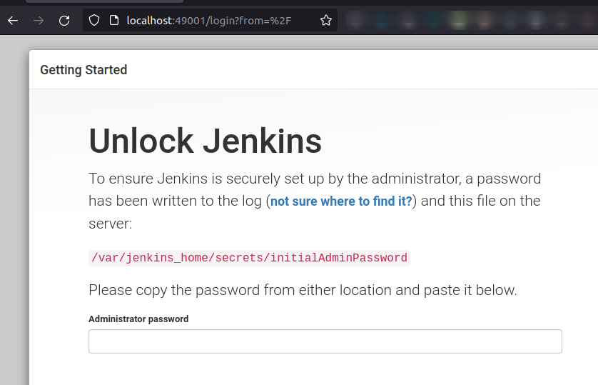
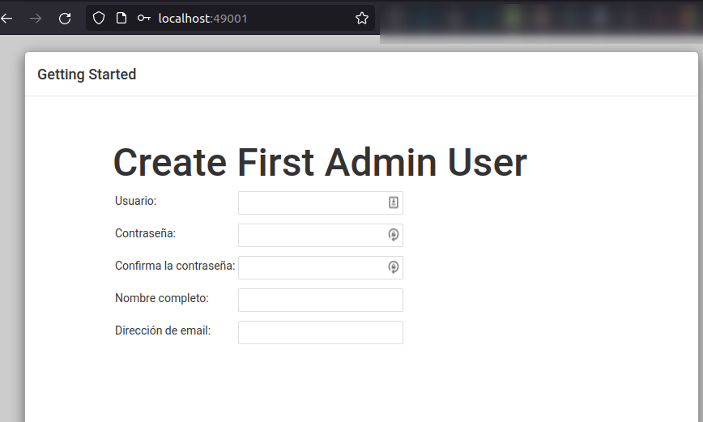
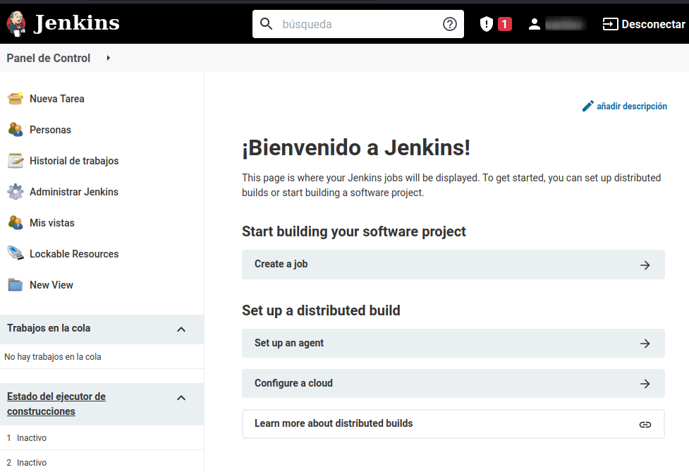
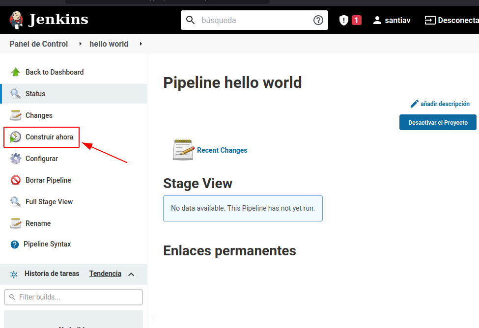
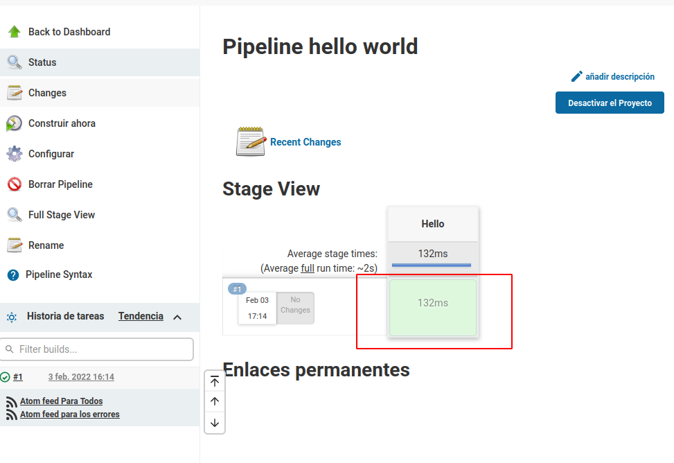
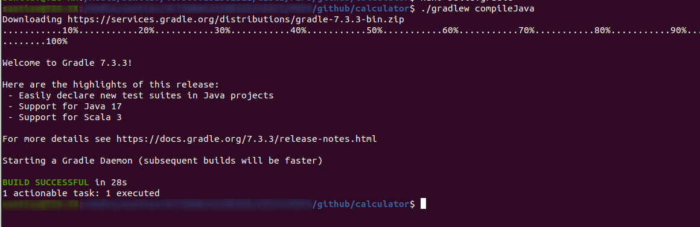
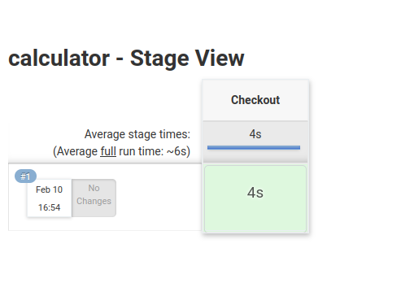
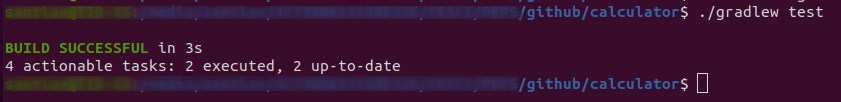

# Práctica Jenkins Calculator


Jenkins es un servidor de automatización de código abierto escrito en java, para implementar procesos de integración y entrega contínua.  Para conocer algo más sobre éste software de integración contínua,  puedes visitar la página web de [Jenkins](https://www.jenkins.io/).

El escenario de nuestra práctica consistirá en la instalación de jenkins dentro de un contenedor docker, el cual irá auditando un el código de un repositorio git.

Crea un directorio que enlazarás como volumen cuando jenkins esté funcionando.
Cambia el propietario del directorio por el que usa jenkins (uid 1000) y asígnales los permisos correspondientes.

```bash
$  mkdir $HOME/jenkins_home
$  sudo chown 1000 $HOME/jenkins_home
$  sudo chmod 777 $HOME/jenkins_home \
   \ docker run -d -p 49001:8080 -v $HOME/jenkins_home:/var/jenkins_home \
   \ --name jenkins jenkins/jenkins:lts-jdk11
```

Ahora puedes abrir un navegador en la dirección que has mapeado mediante las anteriores instrucciones en localhost:49001


        



Para introducir la contraseña de administrador, la podrás recuperar mediante _docker logs jenkins_ o mediante cat al archivo _$HOME/jenkins_home/secrets/initial/AdminPassword_


Ahora, en la ventana inicial instala solo los plugins que vienen por defecto, y comenzarás tu instalación hasta la ventana donde crearás al usuario administrador.




Una vez has terminado este proceso, aquí está la página de administración:





### Primera pipeline

Realizarás tu primera pipeline (nombe de las configuraciones jenkins) con el consabido __Hello Worl__:

- Click en nueva tarea, en la esquina superior izquierda, o job en la parte central de tu pantalla.
- Nómbrala como _hola mundo_, elige _pipeline_  y __acepta__.
- Ve diréctamente a la sección _Pipeline_, de entre todas las opciones.
- Una vez allí, en el cuadro de texto script ingresa lo siguiente:

```bash
    pipeline {
    	agent any
    	stages {
    		stage("Hello") {
    			steps {
    				echo 'Hello World'		
    			}
    		}
    	}
    }
```

- Ahora tienes que guardar, y en la pantalla que se abre,  "_construir ahora_".




En la pantalla siguiente, si todo ha ido bién verás el color verde en tu linea de tiempo.





### Commit Pipeline

_Commit Pipeline_ es el proceso de integración contínua más básico.
Da comienzo con un _commit_ (o push en Git) a tu repositorio principal, y como resultado realizará un informe sobre el éxito o fracaso de la compilación, y se ejecutará después de cada cambio en el código.


El primer paso es crear un repositorio en tu github, con el nombre que tomará tu proyecto, y no olvides añadir un archivo README.md.

Ahora crearás un nueva tarea que llamarás _calculator_ por el mismo procedimiento que el anterior, y en el script de pipeline 

```bash
    pipeline {
        agent any
        stages {
            stage("Checkout") {
                steps {
                    git url: 'https://github.com/savalls/calculator'
                }
            }
        }
    }
```


Ahora te descargarás un proyecto en java Spring Boot:

dirígete a http://start.spring.io 
* Selecciona proyecto Gradle
* Rellena _Group_ y _Artifact_ (_com.tu_usuario_ y _calculator_) 
* Agrega _Web_ a Dependencias
* Clic en _Generar Proyecto_

Si todo ha ido bien, te descargará un archivo _calculator.zip_ que contiene el esqueleto del proyecto.

En el siguiente paso, clona el repositorio de la calculadora que te has creado para el proyecto, y copia el contenido del archivo _.zip_ que acabas  de descargar, con los archivos ocultos incluídos.

Ahora modifica el archivo _build.gradle_ y cambia la versión 


```bash
    id 'org.springframework.boot' version '2.6.3'
```

por

```bash
    id 'org.springframework.boot' version '2.6.2'
```

Ya puedes compilar el programa:

```bash
    ./gradlew compileJava
```



Ahora sube todo a tu repositorio git
```bash
    git add .
    git commit -m "Add Spring Boot skeleton"
    git push
```


Y una vez ya está el repositorio github actualizado, ya puedes realizar la siguiente etapa desde tu máquina docker local _jenkins_, que es la de compilación:



Realizar Test Unitario:

Para realizar esta acción, debes crear dos archivos dentro de tu repositorio git local:

_src/main/java/com/tu_usuario/calculator/Calculator.java
```bash
    package com.tu_usuario.calculator;
    import org.springframework.stereotype.Service;
    
    @Service
    public class Calculator {
         int sum(int a, int b) {
              return a + b;
         }
    }
```

Y
_src/main/java/com/victorponz/calculator/CalculatorController.java_
```bash
    package com.tu_usuario.calculator;
    import org.springframework.beans.factory.annotation.Autowired;
    import org.springframework.web.bind.annotation.RequestMapping;
    import org.springframework.web.bind.annotation.RequestParam;
    import org.springframework.web.bind.annotation.RestController;
    
    @RestController
    class CalculatorController {
         @Autowired
         private Calculator calculator;
    
         @RequestMapping("/sum")
         String sum(@RequestParam("a") Integer a, 
                    @RequestParam("b") Integer b) {
              return String.valueOf(calculator.sum(a, b));
         }
    }
```

Ahora muévete a la raíz de tu repositorio local y ejecuta _./gradlew bootRun_

podrás realizar una operación básica en tu navegador, por ejemplo  [http://localhost:8080/sum?a=1&b=2](http://localhost:8080/sum?a=1&b=2).

Modifica el archivo build.gradle para que _dependencies_ y _task.named_ queden así:

```bash
    dependencies {
    	implementation 'org.springframework.boot:spring-boot-starter-web'
    	testImplementation 'org.springframework.boot:spring-boot-starter-test'
    	testImplementation 'junit:junit:4.13'
    }
    
    tasks.named('test') {
    	useJUnit()
    }
```

Ahora ejecuta un _./gradlew test_ .



