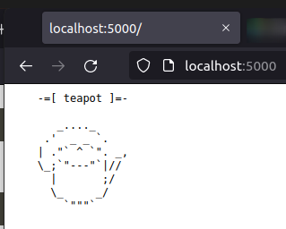
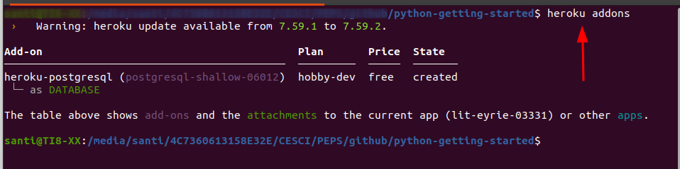

# Práctica Heroku


Para la ejecución de la siguiente práctica, debes instalar la aplicación heroku en tu distro
```bash
$ sudo snap install heroku --classic
```
Después debes crear una cuenta en www.heroku.com y validarte dentro de tu cuenta.

Ahora que ya tienes la cuenta creada, vas a preparar y desplega la aplicación.

Para la preparación, clonarás un repositorio con una apliación simple, y después te posicionas dentro:

```bash
    git clone https://github.com/heroku/python-getting-started.git
    cd python-getting-started
```

### Preparación de la aplicación

Ahora que estás dentro, vas a preparar la aplicación mediante el comando
_$  heroku create_

Ahora que tienes un repositorio git con una aplicación, un archivo _runtime.txt_ y _requirements.txt_, el cual, usará el administrador de dependencias _pip_ de Python.


### Despliegue de la aplicación

Para desplegar la aplicación, ejecuta el comando _$ heroku create_, que creará el git en remoto y le asignará un nombre aleatorio.

Seguídamente realiza un _$ git push heroku main_ , el cual desplegará la aplicación en _http:/nombre_de_tu_aplicacion.herokuapp.com_

Esta aplicación, ahora mismo se está ejecutando en un contenedor ligero, como banco de pruebas, que heroku denomina _dynos_, y que ejecuta el comando especificado en el archivo _Procfile_:
```bash
web: gunicorn gettingstarted.wsgi
```

Estas aplicaciones consument un cierto número de horas gratuitas mensualmente, las cuales se pueden consultar mediante _heroku ps_.  Los dynos, dormirán después de 30min de inactividad, por lo que provoca un retraso de algunos segundos al invocar nuevamente la aplicación.

### Dependencias en aplicaciones locales

Las aplicaciones que se desarrollan en Python tienen un archivo _requirements.txt_ que contienen una lista de programas que precisará dicha aplicación, y que _heroku_ lee e instala mediante el comando _pip install -r_.

Llegado a este punto, vas a crear un entorno virtual propio (_venv_) en el que podrás instalar paquetes sin afectar a la instación de Python en el sistema principal.  Para ello, tienes que instalar el paquete _python3.8-venv_ desde el gestor de programas de tu distribución.

Cuando ya lo tengas, el entorno virtual _venv_ se ejecuta de la siguiente manera:
```bash
$ python3 -m venv venv
```
Y se activa mediante
```bash
$ source venv/bin/activate
```

Ahora para instalarla con _pip_ y el paquete para la conexión mediante Postgres, que  primero deberás instalarl, también, desde tu gestor de paquetes. En Debian, por ejemplo
```bash
$ sudo apt-get install python3-pip libpq-dev
```

Y ahora, sí, puedes instalar las dependencias del entorno virtual
```bash
$ pip install -r requirements.txt
```

Al instalar los paquetes listados en el archivo _requirements.txt_, se instalarán otros paquetes que crean las dependecias, y que podrás listar en tu consola mediante
```bash
$ pip list
```

### Ejecución de la aplicación en local


En un par de pasos tendrás tu aplicación lista para ejecutarla en local, pero antes Django usa activos locales (_assets_), por lo que hay que ejecutar _collestatic_ y seguídamente _heroku local_:

```bash
$ python3 manage.py collecstatic
$ heroku local
```

Ya puedes abrir un navegador en la dirección _http://localhost:5000_ para comprobar el resultado.

### Subir cambios locales


Para realizar cambios, hay que modificar el archivo _requierements.txt_ por lo que añadirás _requests_ a la lista,
```bash
    django
    gunicorn
    django-heroku
    requests
```
y actualizarás las dependencias
```bash
pip install -r requirements.txt
```
Modificamos el archivo _hello/views.py_ para que importe desde el principio:

```bash
import requets
``` 
e index de la siguiente forma:

```bash
    def index(request):
        r = requests.get('https://httpbin.org/status/418')
        return HttpResponse('<pre>' + r.text + '</pre>')
```

y cuando lance la aplicación en local, podrás comprobar el resultado en la dirección
_localhost:5000:

```bash
$ heroku local
```





### Aprovisionamiento de una base de datos

Podrás comprobar los complementos instalados mediante el comando _heroku addons_




