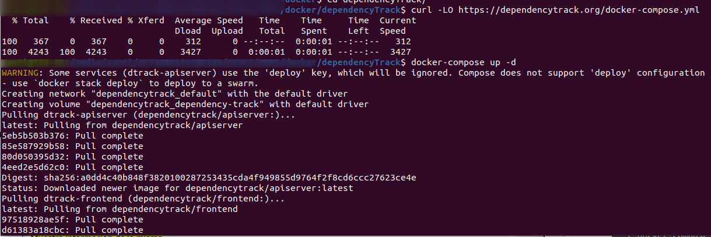
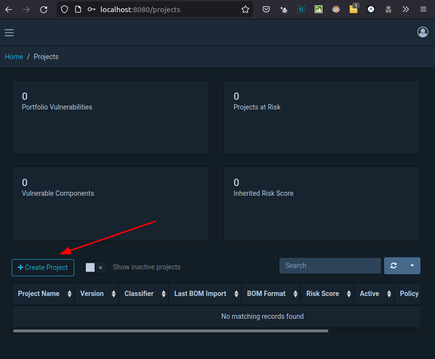
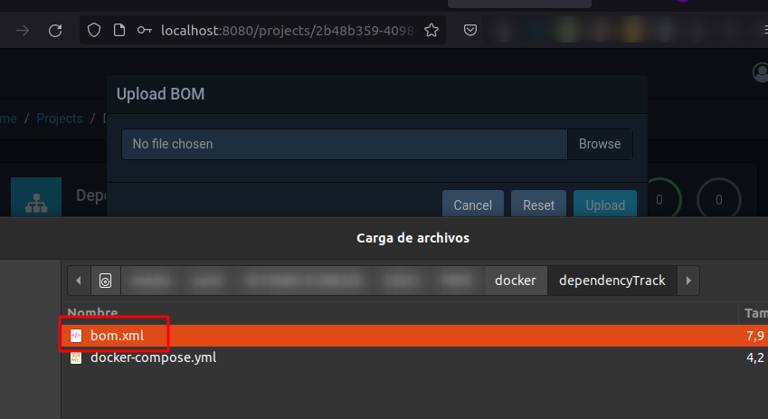
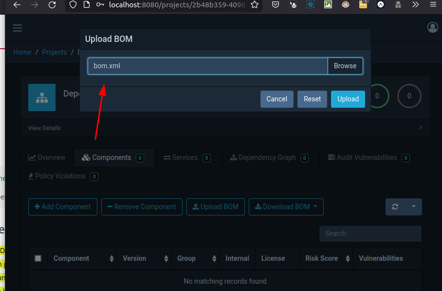
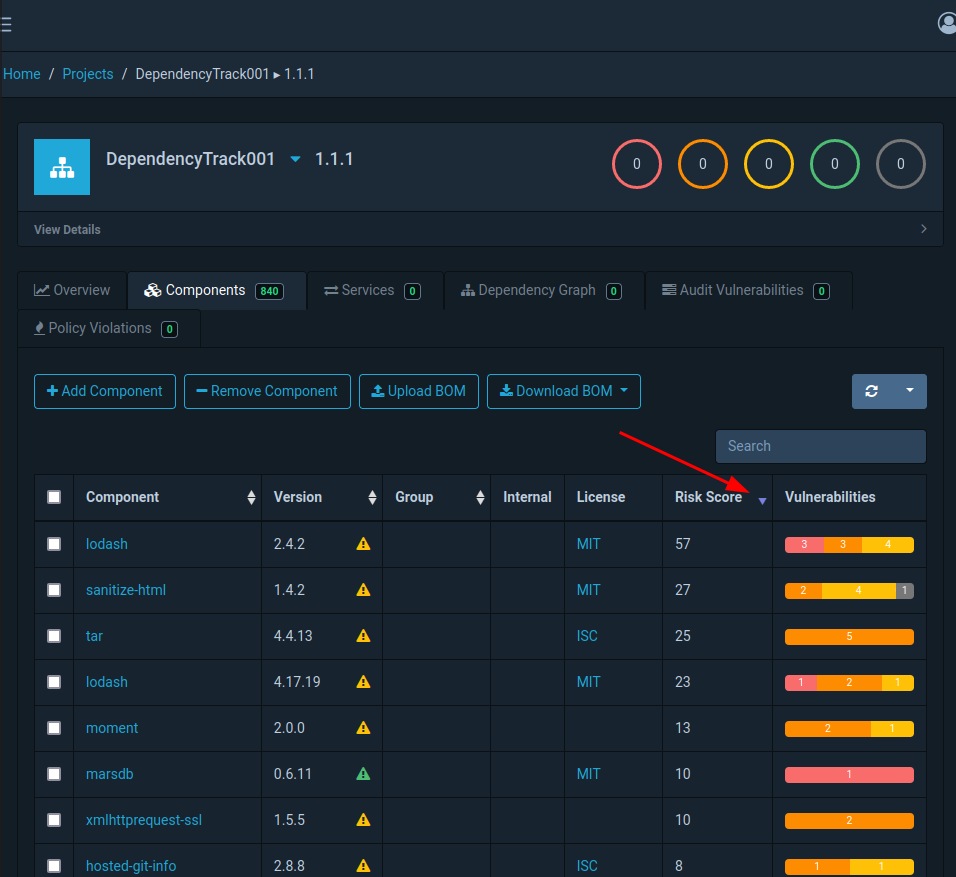
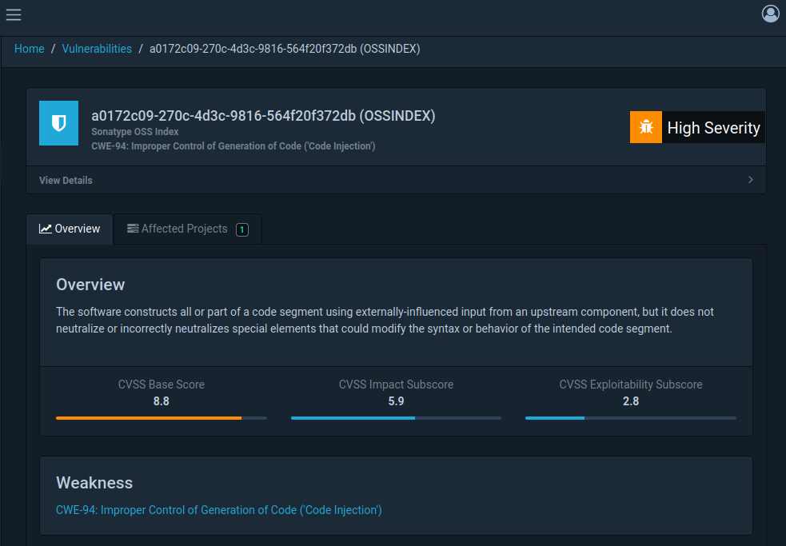

# Tarea Dependency Track OWASP

1.  Instala Dependency Track

|   |

2.  Crea un proyecto

|   |

3.  Carga uno de los ejemplos de SBOM desde la url del repositorio de GitHub proporcionado

|   |
|   |

 4.  Ordena las vulnerabilidades de mayor a menor |

|                                                  |

5.  Muestra información de la misma

|   |

