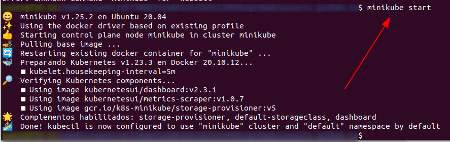
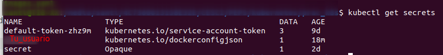

## Tarea Kubernetes


El primer paso para ejecutar Kubernetes es instalarlo, por lo que ejecutarás el instalador de tu distribución. Puedes seguir la guía de la siguiente [dirección](https://kubernetes.io/docs/tasks/tools/install-kubectl-linux/)

Una vez instalado, levanta kubernetes ejecutando _$ minikube start_
Ahora crea una carpeta que contendrá el proyecto y muévete hasta ella.



Ahora crearás un _secret_, que estará basada en el registry de tu cuenta dockerhub, la cual contendrá información sobre el acceso e irá cifrado.


```bash
kubectl create secret docker-registry tu_usuario --docker-server=https://index.docker.io/v1/ --docker-username=tu_usuario --docker-password=tu_password_de_dockerhub --docker-email=tu@email
```
Y una vez has creado el archivo que contiene la contraseña, genera el secreto (realmente se trata de un hash en base64 de dicho archivo)

Podrás comprobar el archivo _secrets_ ejecutando el comando 
```bash
$ kubectl get secrets
```




Seguídamente, edita tu archivo images.yml y configura el nombre de la imagen que quieres que kubernetes replique de tu repositorio dockerhub, y el nombre de Tu_usuario que le diste en el archivo secrets anterior. 

```yaml
apiVersion: apps/v1

kind: Deployment

metadata:

 name: deployment

 labels:

 app: nginx

spec:

 replicas: 3

 selector:

 matchLabels:

 app: nginx

 template:

 metadata:

 labels:

 app: nginx

 spec:

 containers:

\- name: nginx

 image: "RepositorioDockerHub" (usuario/app, sin las comillas)

 ports:

\- containerPort: 80

 imagePullSecrets:

\- name: "Tu_usuario" (el de secrets, sin las comillas)
```

Para finalizar, realiza el despliegue de la aplicación mediante
```bash
kubectl apply -f images.yml
```


 
 
 