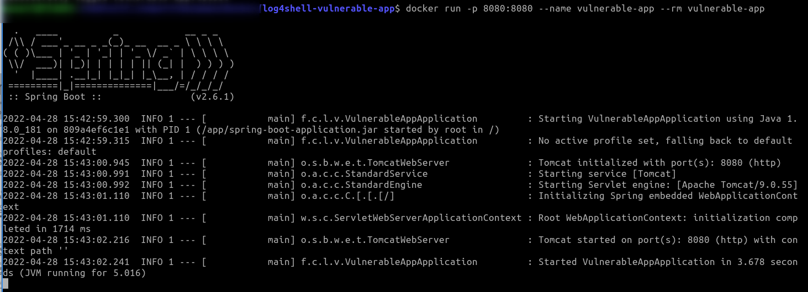
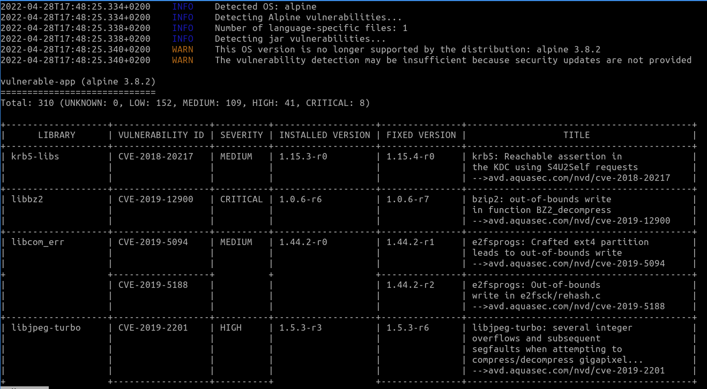

# Tarea Seguridad Docker


En la siguiente tarea vas a descargar el siguiente [repositorio](https://github.com/christophetd/log4shell-vulnerable-app)[ ](https://github.com/christophetd/log4shell-vulnerable-app.git)de github, de una aplicación que contiene la vulnerabilidad [log4shell](https://www.cvedetails.com/cve/CVE-2022-23307/), y que después escanearás con [trivy](https://aquasecurity.github.io/trivy/v0.25.3/).

Para instalar trivy, sigue las indicaciones desde su [apartado](https://aquasecurity.github.io/trivy/v0.25.3/getting-started/installation/ ) para tu distribución.

Una vez clonado el repositorio mediante
```bash
$ git clone https://github.com/christophetd/log4shell-vulnerable-app.git

```
deberás generar la imagen con
```
$ docker build . -t vulnerable-app
```
y seguídamente, deberás realizar un _$ docker run_ 
```bash
$ docker run -p 8080:8080 --name vulnerable-app --rm vulnerable-app
```




Ahora debes correr el aplicativo trivy y como parámetro el nombre de la imagen que quieres examinar
```bash
$ trivy vulnerable-app
```

y te mostrará el conjunto de vulnerabilidades a la que puede verse sometida la imagen de docker.




