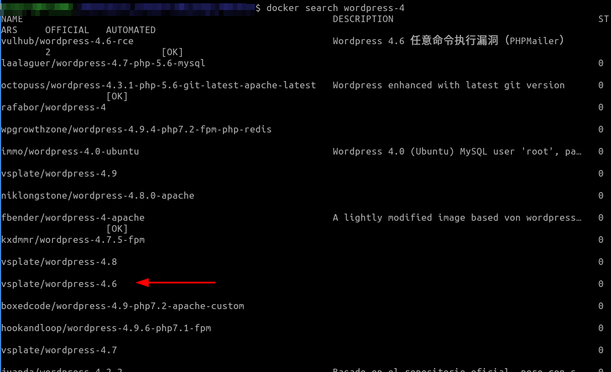
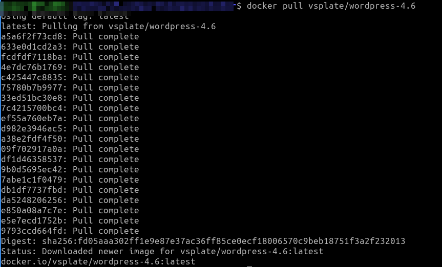
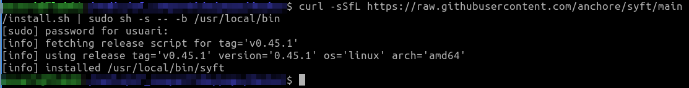
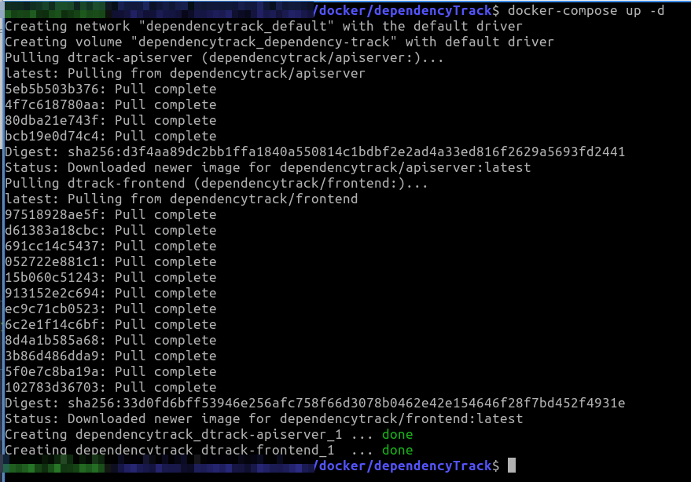
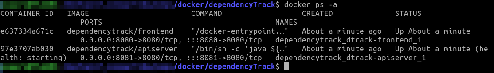
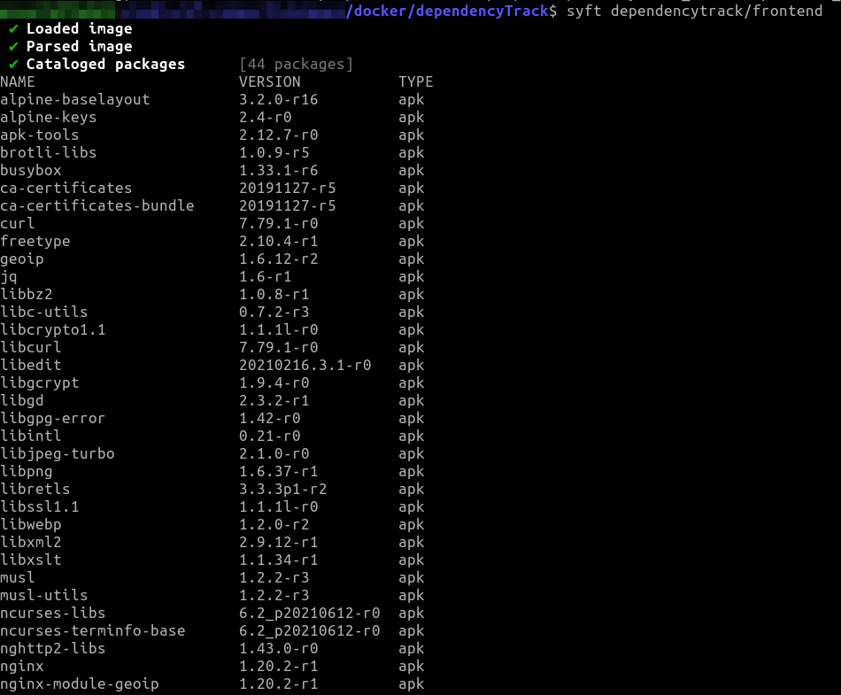
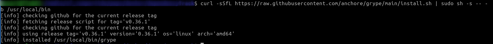
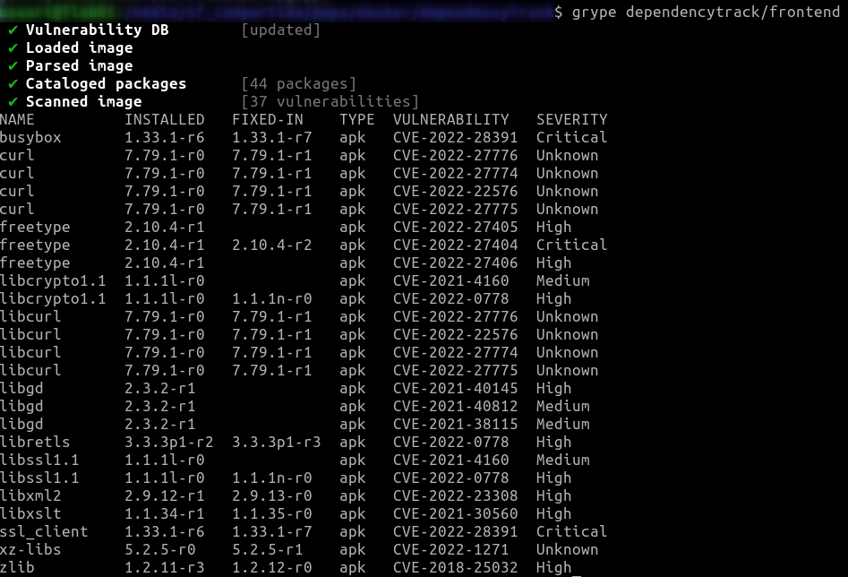

# Tarea Seguridad Docker


Esta tarea consta de tres ejercicios, donde realizaremos un escaneo pasivo de vulnerabilidades en contenedores con dos aplicativos diferentes  [Trivy](https://aquasecurity.github.io/trivy/v0.25.3/) y [Grype](https://github.com/anchore/grype/#installation).


#### A.- Testeo de app-vulnerable con Trivy.

En la siguiente tarea vas a descargar el siguiente [repositorio](https://github.com/christophetd/log4shell-vulnerable-app)[ ](https://github.com/christophetd/log4shell-vulnerable-app.git)de github, de una aplicación que contiene la vulnerabilidad [log4shell](https://www.cvedetails.com/cve/CVE-2022-23307/), y que después escanearás con [trivy](https://aquasecurity.github.io/trivy/v0.25.3/).

Para instalar trivy, sigue las indicaciones desde su [apartado](https://aquasecurity.github.io/trivy/v0.25.3/getting-started/installation/ ) para tu distribución.

Una vez clonado el repositorio mediante
```bash
$ git clone https://github.com/christophetd/log4shell-vulnerable-app.git

```

Posiciónate dentro del directorio del proyecto y estudia los ficheros que lo componen.
Observa el documento README.md, donde detalla el proceso de la ejecución de la aplicación...:

- Genera la imagen con
```
$ docker build . -t vulnerable-app
```

- Ejecuta un _$ docker run_ 
```bash
$ docker run -p 8080:8080 --name vulnerable-app --rm vulnerable-app
```


Ahora debes correr el aplicativo trivy (que habrás instalado previamente en tu distribución),  y como parámetro el nombre de la imagen que quieres examinar
```bash
$ trivy vulnerable-app
```

y te mostrará el conjunto de vulnerabilidades a la que puede verse sometida la imagen de docker.


#### B.-  Testeo Wordpress con trivy.

De la misma forma que en el ejercicio anterior, examinaremos con trivy alguna versión antigua de wordpress..

A día de hoy, la versión más reciente Wordpress se encuentra en una versión por encima de la rama 5.9, por lo que puedes realizar una búsqueda en docker por alguna rama inferior.   Por ejemplo
```bash
$ docker search wordpress-4
```


Ahora realiza un docker pull para bajar la imagen propuesta
```bash
$ docker pull vsplate/wordpress-4.6
```




Y ahora escanea la imagen con trivy
```bash
$ trivy image vsplate/wordpress-4.6
```
Este será el resultado del escaneo propuesto


#### C.-  Testeo con DependencyTrack a partir del BOM generado con [Syft](https://github.com/anchore/syft/), y con [Grype](https://github.com/anchore/grype/).


En el siguiente ejercicio generarás un testeo con otras herramientas de escaneo de seguridad de [anchore](https://anchore.com/opensource/), como [syft](https://github.com/anchore/syft/) y [grype](https://github.com/anchore/grype/). 

La característica principal de [syft](https://github.com/anchore/syft/) es que va a generar un SBOM (lista de materiales del software) de la imagen contenedor, esto es que va a desgranar el tipo de componentes y su versión, de que se compone.

Para instalar [syft](https://github.com/anchore/syft/) recurriremos al script de instalación que figura en la página del proyecto.
```bash
$ curl -sSfL https://raw.githubusercontent.com/anchore/syft/main/install.sh | sudo sh -s -- -b /usr/local/bin
```


Como puedes observar, una vez introducido la clave de administrador, quedará listo.


Ahora bájate la imagen de [DependyTrack](https://dependencytrack.org/) que encontrarás  en su apartado Download, en un directorio que habrás creado previamente

```bash
$ curl -LO https://dependencytrack.org/docker-compose.yml
$ docker-compose up -d
```




Ahora realiza un _docker ps -a_ para comprobar las imagenes que se han creado



Ya solo queda invocar el comando syft con el nombre de la imagen como parámetro
```bash
$ syft dependencytrack/frontend
```



—

Una vez hemos escaneado el container con syft para conocer su composición, vamos a seguir el mismo procedimiento para escanear elcontenido, esta vez con [grype](https://github.com/anchore/grype) 

Para ello en primer lugar hay que instalar la utilidad en nuestro sistema, siguiendo las indicaciones desde su página web.

```bash
$ curl -sSfL https://raw.githubusercontent.com/anchore/grype/main/install.sh | sudo sh -s -- -b /usr/local/bin
```



Ahora solo tienes que indicarle la imagen docker que quieres evaluar, de cualquier que tengas en funcionamiento.  Lo puedes consultar mediante _docker ps -a_


```bash
$ grype image_docker
```




