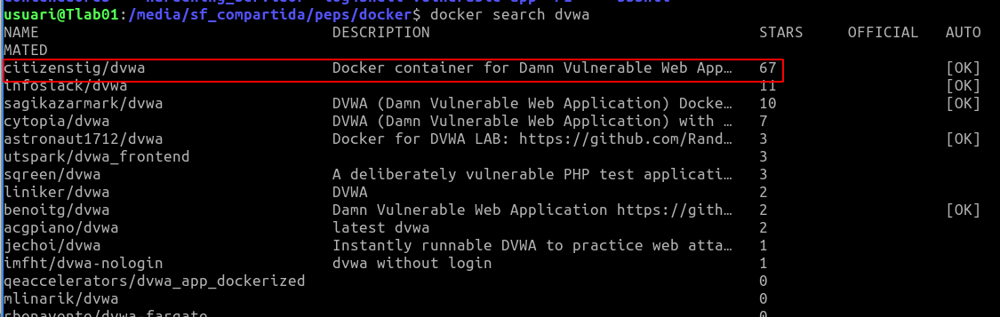

# Tarea Fileupload


Esta tarea consta de .… DVWA.

Necesitar instalar una web vulnerable como un contenedor docker, tienes que buscar la imagen docker dvwa
```bash
$ docker search dvwa
```




y lo ejecutas
```bash
$ docker run --rm -it -p 8080:80 citizenstig/dvwa
```


